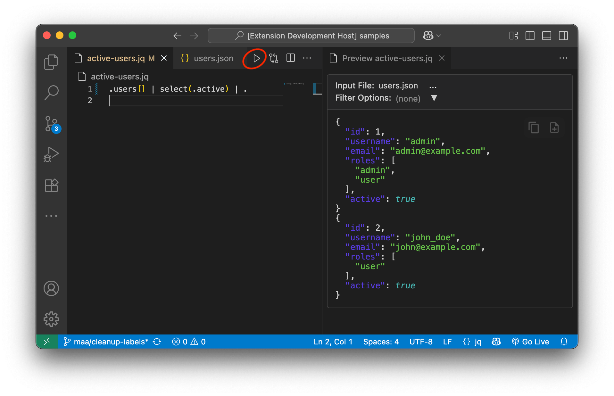

# VSCode jq Playground

A VS Code extension that provides live preview functionality for jq filters.
When editing `.jq` files, you can click the preview button (▷) to see the
results of applying your jq filter to a selected file in your workspace. It is
designed to mimic the streamlined experience of the official jq Playground
web application, but directly within VS Code.



## Features

- **Live Preview**: The preview updates automatically on any change to the jq
  filter or the input document, providing instant feedback.
- **Filter Option**: Input file and jq command-line options (e.g., `-c`, `-r`,
  `-s`) can be edited in the preview window.
- **Error Feedback**: Any error from the invocation of jq is clearly displayed
  in the preview in place of the result.
- **Background Activity Indicator**: When the output takes time to process, the
  prior output is preserved while the update is in progress, indicated by a
  background activity indicator at the top of the window.


## Requirements

- [jq](https://stedolan.github.io/jq/) must be installed on your system and
  available in your PATH
- VS Code 1.74.0 or higher

## Installation

To install jq:

### macOS
```bash
brew install jq
```

### Ubuntu/Debian
```bash
sudo apt-get install jq
```

### Windows
Download from [jq releases page](https://github.com/stedolan/jq/releases) or use
chocolatey:
```bash
choco install jq
```

## Usage

1. Create or open a `.jq` file containing your jq filter
2. Click the preview button (▷) in the editor title bar
3. Select an input file to apply the filter to
4. Edit the jq options as needed based on the filter and input type
5. Make edits to your filter and observe immediate effects on the output

## Example

Create a JSON file `people.json`:
```json
[
  {"name": "Alice", "age": 30, "city": "New York"},
  {"name": "Bob", "age": 22, "city": "San Francisco"},
  {"name": "Charlie", "age": 35, "city": "Chicago"}
]
```

Create a jq file `filter.jq`
```jq
.[] | select(.age > 25) | {name, age}
```

In the filter window, click the preview button (▷) on the top right, and select
`people.json` when prompted.

A live preview window will open, showing the results of applying the jq
filter to the `people.json` file. You can edit the jq filter or the input file
and the preview will update automatically.


## Development

To run the extension in development mode:

1. Clone this repository
2. Run `npm install`
3. Run `npm run compile` (optional)
4. Press F5 to compile and launch the extension in a new Extension Development
   Host window, opened on the included samples folder
5. Test the extension with `.jq` and `.json` files

## Compatibility

- This extension is compatible with other jq syntax-highlighting extensions. If
  another extension provides only syntax highlighting, both will work together.
  If multiple extensions provide a language configuration for jq, the result may
  depend on activation order.
